BER\_models
================
TXL

Exploration of different models for BER calculation
===================================================

Load 2018 Data

``` r
# Make sure folder is correct
folder_name = "/Users/txl/TXL_R/Final Data"
dt = fread(paste(folder_name, "/2018dataClean.csv", sep = ""))

# Rename "Runs Scored till end of inning"
dt %>% setnames(old = c("Position Before", "Position After",
                        "Runs Scored till end of inning", "League",
                        "Park_Factor", "FIP_Pitcher_Control"), 
                new = c("position_before", "position_after", 
                        "runs_scored_EOI", "league",
                        "park_factor", "FIP"))

# Make position_before and position_after factors
dt$position_before = as.factor(dt$position_before)
dt$position_after = as.factor(dt$position_after)

# Make league a factor
dt$league = as.factor(dt$league)

# Divide park_factor by 100 to turn to a percent measure
dt$park_factor = dt$park_factor / 100

# Turn FIP into numeric
dt$FIP = as.numeric(dt$FIP)
```

    ## Warning: NAs introduced by coercion

Preliminary Visualizations for Factors
======================================

``` r
## Explore park_factor
parks_dt = unique(dt[, c("Stadium", "park_factor")])
# Bargraph
ggplot(parks_dt, aes(x = Stadium, y = park_factor)) + 
  geom_bar(stat = "identity") +
  theme(axis.text.x = element_text(angle = 90)) + 
  ggtitle("Park Factors")
```

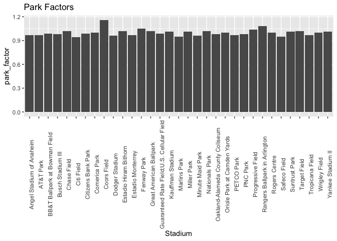

``` r
## Explore FIP
fip_dt = unique(dt[, c("res_pitcher", "FIP")])
# Histogram
ggplot(fip_dt, aes(x = FIP)) + 
  geom_histogram(binwidth = .5) + 
  ggtitle("Histogram of FIP")
```

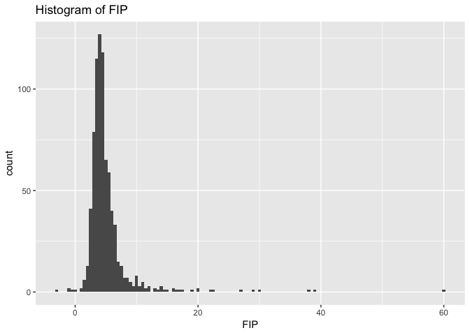

Some notes here: + Maybe we need to remove some outliers in FIP + Leaving park\_factor as is since it looks like a percentage measure

Model 1: position\_before only
==============================

``` r
m1 = lm(runs_scored_EOI ~ position_before - 1, 
        dat = dt)
summary(m1)
```

    ## 
    ## Call:
    ## lm(formula = runs_scored_EOI ~ position_before - 1, data = dt)
    ## 
    ## Residuals:
    ##     Min      1Q  Median      3Q     Max 
    ## -2.3283 -0.4983 -0.2684 -0.0995 10.5017 
    ## 
    ## Coefficients:
    ##                            Estimate Std. Error t value Pr(>|t|)    
    ## position_before['0,0,0,0'] 0.498346   0.004538  109.81   <2e-16 ***
    ## position_before['0,0,0,1'] 1.423913   0.045207   31.50   <2e-16 ***
    ## position_before['0,0,1,0'] 1.129808   0.017358   65.09   <2e-16 ***
    ## position_before['0,0,1,1'] 1.914826   0.038507   49.73   <2e-16 ***
    ## position_before['0,1,0,0'] 0.868164   0.009730   89.22   <2e-16 ***
    ## position_before['0,1,0,1'] 1.782857   0.032778   54.39   <2e-16 ***
    ## position_before['0,1,1,0'] 1.416302   0.019334   73.26   <2e-16 ***
    ## position_before['0,1,1,1'] 2.328336   0.037542   62.02   <2e-16 ***
    ## position_before['1,0,0,0'] 0.268430   0.005307   50.58   <2e-16 ***
    ## position_before['1,0,0,1'] 1.000000   0.023098   43.29   <2e-16 ***
    ## position_before['1,0,1,0'] 0.678449   0.013780   49.24   <2e-16 ***
    ## position_before['1,0,1,1'] 1.357827   0.024509   55.40   <2e-16 ***
    ## position_before['1,1,0,0'] 0.531876   0.008805   60.40   <2e-16 ***
    ## position_before['1,1,0,1'] 1.200207   0.022082   54.35   <2e-16 ***
    ## position_before['1,1,1,0'] 0.931957   0.014602   63.82   <2e-16 ***
    ## position_before['1,1,1,1'] 1.457596   0.023949   60.86   <2e-16 ***
    ## position_before['2,0,0,0'] 0.099487   0.005955   16.70   <2e-16 ***
    ## position_before['2,0,0,1'] 0.341967   0.018785   18.20   <2e-16 ***
    ## position_before['2,0,1,0'] 0.324691   0.011836   27.43   <2e-16 ***
    ## position_before['2,0,1,1'] 0.560976   0.022573   24.85   <2e-16 ***
    ## position_before['2,1,0,0'] 0.215019   0.008789   24.47   <2e-16 ***
    ## position_before['2,1,0,1'] 0.489754   0.019629   24.95   <2e-16 ***
    ## position_before['2,1,1,0'] 0.443303   0.013134   33.75   <2e-16 ***
    ## position_before['2,1,1,1'] 0.764594   0.021123   36.20   <2e-16 ***
    ## ---
    ## Signif. codes:  0 '***' 0.001 '**' 0.01 '*' 0.05 '.' 0.1 ' ' 1
    ## 
    ## Residual standard error: 0.9696 on 185477 degrees of freedom
    ## Multiple R-squared:  0.2736, Adjusted R-squared:  0.2735 
    ## F-statistic:  2910 on 24 and 185477 DF,  p-value: < 2.2e-16

``` r
m1_vt = m1$coefficients %>% data.table(factor = names(.), value = .)

#Graph coefficients
m1_vt %>% 
  ggplot(aes(x = factor, y = value)) + geom_bar(stat = "identity") + 
  theme(axis.text.x = element_text(angle = 90)) +
  ggtitle("M1 Coefficients")
```

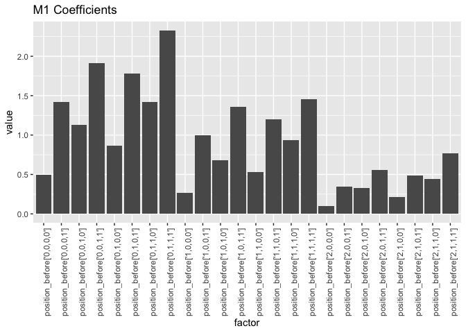

Model 2:
========

Model 2 Version 1: position\_before and league (no interaction)
---------------------------------------------------------------

``` r
m2_v1 = lm(runs_scored_EOI ~ position_before + league - 1, 
        dat = dt)
summary(m2_v1)
```

    ## 
    ## Call:
    ## lm(formula = runs_scored_EOI ~ position_before + league - 1, 
    ##     data = dt)
    ## 
    ## Residuals:
    ##     Min      1Q  Median      3Q     Max 
    ## -2.3397 -0.5016 -0.2566 -0.0877 10.4898 
    ## 
    ## Coefficients:
    ##                             Estimate Std. Error t value Pr(>|t|)    
    ## position_before['0,0,0,0']  0.510197   0.005070 100.633  < 2e-16 ***
    ## position_before['0,0,0,1']  1.436382   0.045266  31.732  < 2e-16 ***
    ## position_before['0,0,1,0']  1.140777   0.017483  65.252  < 2e-16 ***
    ## position_before['0,0,1,1']  1.925995   0.038563  49.944  < 2e-16 ***
    ## position_before['0,1,0,0']  0.880217   0.009998  88.042  < 2e-16 ***
    ## position_before['0,1,0,1']  1.794295   0.032848  54.624  < 2e-16 ***
    ## position_before['0,1,1,0']  1.427949   0.019460  73.380  < 2e-16 ***
    ## position_before['0,1,1,1']  2.339695   0.037602  62.222  < 2e-16 ***
    ## position_before['1,0,0,0']  0.280238   0.005765  48.614  < 2e-16 ***
    ## position_before['1,0,0,1']  1.011802   0.023206  43.601  < 2e-16 ***
    ## position_before['1,0,1,0']  0.690043   0.013955  49.448  < 2e-16 ***
    ## position_before['1,0,1,1']  1.369245   0.024604  55.652  < 2e-16 ***
    ## position_before['1,1,0,0']  0.543741   0.009091  59.811  < 2e-16 ***
    ## position_before['1,1,0,1']  1.212156   0.022197  54.608  < 2e-16 ***
    ## position_before['1,1,1,0']  0.943665   0.014771  63.887  < 2e-16 ***
    ## position_before['1,1,1,1']  1.469996   0.024064  61.086  < 2e-16 ***
    ## position_before['2,0,0,0']  0.111306   0.006368  17.480  < 2e-16 ***
    ## position_before['2,0,0,1']  0.353521   0.018913  18.692  < 2e-16 ***
    ## position_before['2,0,1,0']  0.336744   0.012056  27.932  < 2e-16 ***
    ## position_before['2,0,1,1']  0.572937   0.022686  25.255  < 2e-16 ***
    ## position_before['2,1,0,0']  0.226861   0.009074  25.002  < 2e-16 ***
    ## position_before['2,1,0,1']  0.501595   0.019757  25.389  < 2e-16 ***
    ## position_before['2,1,1,0']  0.455477   0.013336  34.153  < 2e-16 ***
    ## position_before['2,1,1,1']  0.777376   0.021262  36.562  < 2e-16 ***
    ## leagueNL                   -0.023604   0.004503  -5.242 1.59e-07 ***
    ## ---
    ## Signif. codes:  0 '***' 0.001 '**' 0.01 '*' 0.05 '.' 0.1 ' ' 1
    ## 
    ## Residual standard error: 0.9695 on 185476 degrees of freedom
    ## Multiple R-squared:  0.2737, Adjusted R-squared:  0.2736 
    ## F-statistic:  2795 on 25 and 185476 DF,  p-value: < 2.2e-16

``` r
m2_v1_vt = m2_v1$coefficients %>% data.table(factor = names(.), value = .)

m2_v1_vt %>%
  ggplot(aes(x = factor, y = value)) + geom_bar(stat = "identity") +
  theme(axis.text.x = element_text(angle = 90)) + 
  ggtitle("m2_v1 Coefficients (all factors)")
```

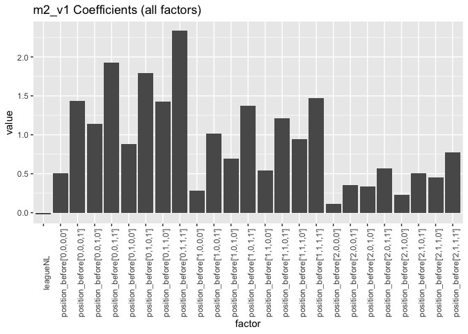

Model 2 Version 2: position\_before and league (include main league effect)
---------------------------------------------------------------------------

``` r
m2_v2 = lm(runs_scored_EOI ~ position_before * league - 1, 
           dat = dt)
summary(m2_v2)
```

    ## 
    ## Call:
    ## lm(formula = runs_scored_EOI ~ position_before * league - 1, 
    ##     data = dt)
    ## 
    ## Residuals:
    ##     Min      1Q  Median      3Q     Max 
    ## -2.3707 -0.4951 -0.2575 -0.0958 10.4854 
    ## 
    ## Coefficients:
    ##                                      Estimate Std. Error t value Pr(>|t|)
    ## position_before['0,0,0,0']           0.514564   0.006430  80.019  < 2e-16
    ## position_before['0,0,0,1']           1.364055   0.065810  20.727  < 2e-16
    ## position_before['0,0,1,0']           1.114371   0.023723  46.975  < 2e-16
    ## position_before['0,0,1,1']           1.976048   0.053046  37.252  < 2e-16
    ## position_before['0,1,0,0']           0.902449   0.013908  64.889  < 2e-16
    ## position_before['0,1,0,1']           1.862528   0.045650  40.801  < 2e-16
    ## position_before['0,1,1,0']           1.476452   0.027161  54.360  < 2e-16
    ## position_before['0,1,1,1']           2.289017   0.052118  43.920  < 2e-16
    ## position_before['1,0,0,0']           0.279326   0.007506  37.216  < 2e-16
    ## position_before['1,0,0,1']           0.994325   0.032662  30.443  < 2e-16
    ## position_before['1,0,1,0']           0.695117   0.019316  35.987  < 2e-16
    ## position_before['1,0,1,1']           1.363861   0.034105  39.990  < 2e-16
    ## position_before['1,1,0,0']           0.542289   0.012484  43.437  < 2e-16
    ## position_before['1,1,0,1']           1.220588   0.031420  38.847  < 2e-16
    ## position_before['1,1,1,0']           0.954545   0.020566  46.413  < 2e-16
    ## position_before['1,1,1,1']           1.551414   0.034756  44.637  < 2e-16
    ## position_before['2,0,0,0']           0.103143   0.008427  12.239  < 2e-16
    ## position_before['2,0,0,1']           0.333088   0.026288  12.671  < 2e-16
    ## position_before['2,0,1,0']           0.312119   0.016917  18.450  < 2e-16
    ## position_before['2,0,1,1']           0.570330   0.032137  17.747  < 2e-16
    ## position_before['2,1,0,0']           0.223248   0.012448  17.934  < 2e-16
    ## position_before['2,1,0,1']           0.484375   0.027801  17.423  < 2e-16
    ## position_before['2,1,1,0']           0.442971   0.018871  23.473  < 2e-16
    ## position_before['2,1,1,1']           0.768116   0.031191  24.626  < 2e-16
    ## leagueNL                            -0.032301   0.009075  -3.559 0.000372
    ## position_before['0,0,0,1']:leagueNL  0.145612   0.091000   1.600 0.109570
    ## position_before['0,0,1,0']:leagueNL  0.065516   0.035962   1.822 0.068486
    ## position_before['0,0,1,1']:leagueNL -0.097080   0.077647  -1.250 0.211200
    ## position_before['0,1,0,0']:leagueNL -0.034842   0.021474  -1.622 0.104702
    ## position_before['0,1,0,1']:leagueNL -0.132113   0.066203  -1.996 0.045981
    ## position_before['0,1,1,0']:leagueNL -0.089598   0.039716  -2.256 0.024075
    ## position_before['0,1,1,1']:leagueNL  0.114001   0.075673   1.506 0.131945
    ## position_before['1,0,0,0']:leagueNL  0.010520   0.013963   0.753 0.451203
    ## position_before['1,0,0,1']:leagueNL  0.043652   0.047073   0.927 0.353762
    ## position_before['1,0,1,0']:leagueNL -0.001631   0.029016  -0.056 0.955161
    ## position_before['1,0,1,1']:leagueNL  0.019827   0.049870   0.398 0.690944
    ## position_before['1,1,0,0']:leagueNL  0.011588   0.019810   0.585 0.558569
    ## position_before['1,1,0,1']:leagueNL -0.007959   0.045083  -0.177 0.859872
    ## position_before['1,1,1,0']:leagueNL -0.013236   0.030579  -0.433 0.665120
    ## position_before['1,1,1,1']:leagueNL -0.146290   0.048805  -2.997 0.002723
    ## position_before['2,0,0,0']:leagueNL  0.024999   0.014973   1.670 0.095000
    ## position_before['2,0,0,1']:leagueNL  0.050440   0.038654   1.305 0.191925
    ## position_before['2,0,1,0']:leagueNL  0.056920   0.025353   2.245 0.024765
    ## position_before['2,0,1,1']:leagueNL  0.013843   0.046047   0.301 0.763690
    ## position_before['2,1,0,0']:leagueNL  0.015899   0.019780   0.804 0.421512
    ## position_before['2,1,0,1']:leagueNL  0.043024   0.040288   1.068 0.285551
    ## position_before['2,1,1,0']:leagueNL  0.032945   0.027800   1.185 0.235988
    ## position_before['2,1,1,1']:leagueNL  0.025798   0.043347   0.595 0.551741
    ##                                        
    ## position_before['0,0,0,0']          ***
    ## position_before['0,0,0,1']          ***
    ## position_before['0,0,1,0']          ***
    ## position_before['0,0,1,1']          ***
    ## position_before['0,1,0,0']          ***
    ## position_before['0,1,0,1']          ***
    ## position_before['0,1,1,0']          ***
    ## position_before['0,1,1,1']          ***
    ## position_before['1,0,0,0']          ***
    ## position_before['1,0,0,1']          ***
    ## position_before['1,0,1,0']          ***
    ## position_before['1,0,1,1']          ***
    ## position_before['1,1,0,0']          ***
    ## position_before['1,1,0,1']          ***
    ## position_before['1,1,1,0']          ***
    ## position_before['1,1,1,1']          ***
    ## position_before['2,0,0,0']          ***
    ## position_before['2,0,0,1']          ***
    ## position_before['2,0,1,0']          ***
    ## position_before['2,0,1,1']          ***
    ## position_before['2,1,0,0']          ***
    ## position_before['2,1,0,1']          ***
    ## position_before['2,1,1,0']          ***
    ## position_before['2,1,1,1']          ***
    ## leagueNL                            ***
    ## position_before['0,0,0,1']:leagueNL    
    ## position_before['0,0,1,0']:leagueNL .  
    ## position_before['0,0,1,1']:leagueNL    
    ## position_before['0,1,0,0']:leagueNL    
    ## position_before['0,1,0,1']:leagueNL *  
    ## position_before['0,1,1,0']:leagueNL *  
    ## position_before['0,1,1,1']:leagueNL    
    ## position_before['1,0,0,0']:leagueNL    
    ## position_before['1,0,0,1']:leagueNL    
    ## position_before['1,0,1,0']:leagueNL    
    ## position_before['1,0,1,1']:leagueNL    
    ## position_before['1,1,0,0']:leagueNL    
    ## position_before['1,1,0,1']:leagueNL    
    ## position_before['1,1,1,0']:leagueNL    
    ## position_before['1,1,1,1']:leagueNL ** 
    ## position_before['2,0,0,0']:leagueNL .  
    ## position_before['2,0,0,1']:leagueNL    
    ## position_before['2,0,1,0']:leagueNL *  
    ## position_before['2,0,1,1']:leagueNL    
    ## position_before['2,1,0,0']:leagueNL    
    ## position_before['2,1,0,1']:leagueNL    
    ## position_before['2,1,1,0']:leagueNL    
    ## position_before['2,1,1,1']:leagueNL    
    ## ---
    ## Signif. codes:  0 '***' 0.001 '**' 0.01 '*' 0.05 '.' 0.1 ' ' 1
    ## 
    ## Residual standard error: 0.9694 on 185453 degrees of freedom
    ## Multiple R-squared:  0.2739, Adjusted R-squared:  0.2737 
    ## F-statistic:  1457 on 48 and 185453 DF,  p-value: < 2.2e-16

``` r
m2_v2_vt = m2_v2$coefficients %>% data.table(factor = names(.), value = .)

# Graph all factor values
m2_v2_vt %>%
  ggplot(aes(x = factor, y = value)) + geom_bar(stat = "identity") + 
  theme(axis.text.x = element_text(angle = 90)) +
  ggtitle("m2_v2 Coefficients (all factors)")
```

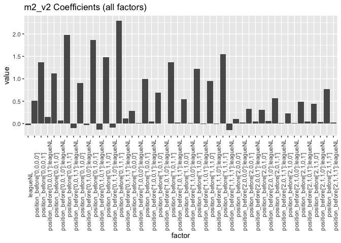

``` r
# Graph only position_before values
m2_v2_vt[1:24, ] %>%
  ggplot(aes(x = factor, y = value)) + geom_bar(stat = "identity") + 
  theme(axis.text.x = element_text(angle = 90)) +
  ggtitle("m2_v2 Coefficients (position_before only)")
```

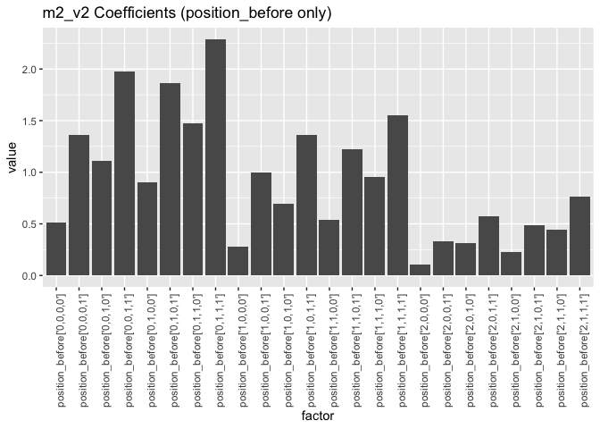

``` r
# Graph interaction effect values
m2_v2_vt[25:48, ] %>%
  ggplot(aes(x = factor, y = value)) + geom_bar(stat = "identity") + 
  theme(axis.text.x = element_text(angle = 90)) +
  ggtitle("m2_v2 Coefficients (interaction only)")
```

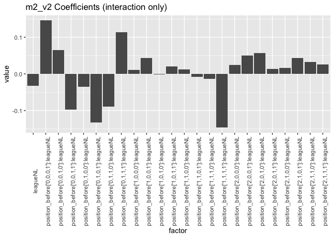

Model 2 Version 3: position\_before and league (without main league effect)
---------------------------------------------------------------------------

``` r
m2_v3 = lm(runs_scored_EOI ~ position_before + position_before:league - 1, 
           dat = dt)
summary(m2_v3)
```

    ## 
    ## Call:
    ## lm(formula = runs_scored_EOI ~ position_before + position_before:league - 
    ##     1, data = dt)
    ## 
    ## Residuals:
    ##     Min      1Q  Median      3Q     Max 
    ## -2.3707 -0.4951 -0.2575 -0.0958 10.4854 
    ## 
    ## Coefficients:
    ##                                       Estimate Std. Error t value Pr(>|t|)
    ## position_before['0,0,0,0']           0.5145635  0.0064305  80.019  < 2e-16
    ## position_before['0,0,0,1']           1.3640553  0.0658104  20.727  < 2e-16
    ## position_before['0,0,1,0']           1.1143713  0.0237228  46.975  < 2e-16
    ## position_before['0,0,1,1']           1.9760479  0.0530459  37.252  < 2e-16
    ## position_before['0,1,0,0']           0.9024491  0.0139076  64.889  < 2e-16
    ## position_before['0,1,0,1']           1.8625277  0.0456495  40.801  < 2e-16
    ## position_before['0,1,1,0']           1.4764521  0.0271606  54.360  < 2e-16
    ## position_before['0,1,1,1']           2.2890173  0.0521179  43.920  < 2e-16
    ## position_before['1,0,0,0']           0.2793263  0.0075056  37.216  < 2e-16
    ## position_before['1,0,0,1']           0.9943246  0.0326615  30.443  < 2e-16
    ## position_before['1,0,1,0']           0.6951171  0.0193157  35.987  < 2e-16
    ## position_before['1,0,1,1']           1.3638614  0.0341051  39.990  < 2e-16
    ## position_before['1,1,0,0']           0.5422886  0.0124844  43.437  < 2e-16
    ## position_before['1,1,0,1']           1.2205882  0.0314200  38.847  < 2e-16
    ## position_before['1,1,1,0']           0.9545455  0.0205661  46.413  < 2e-16
    ## position_before['1,1,1,1']           1.5514139  0.0347564  44.637  < 2e-16
    ## position_before['2,0,0,0']           0.1031434  0.0084271  12.239  < 2e-16
    ## position_before['2,0,0,1']           0.3330882  0.0262879  12.671  < 2e-16
    ## position_before['2,0,1,0']           0.3121194  0.0169170  18.450  < 2e-16
    ## position_before['2,0,1,1']           0.5703297  0.0321369  17.747  < 2e-16
    ## position_before['2,1,0,0']           0.2232481  0.0124483  17.934  < 2e-16
    ## position_before['2,1,0,1']           0.4843750  0.0278008  17.423  < 2e-16
    ## position_before['2,1,1,0']           0.4429708  0.0188714  23.473  < 2e-16
    ## position_before['2,1,1,1']           0.7681159  0.0311915  24.626  < 2e-16
    ## position_before['0,0,0,0']:leagueNL -0.0323015  0.0090753  -3.559 0.000372
    ## position_before['0,0,0,1']:leagueNL  0.1133110  0.0905463   1.251 0.210785
    ## position_before['0,0,1,0']:leagueNL  0.0332149  0.0347984   0.954 0.339834
    ## position_before['0,0,1,1']:leagueNL -0.1293812  0.0771144  -1.678 0.093391
    ## position_before['0,1,0,0']:leagueNL -0.0671433  0.0194626  -3.450 0.000561
    ## position_before['0,1,0,1']:leagueNL -0.1644145  0.0655779  -2.507 0.012171
    ## position_before['0,1,1,0']:leagueNL -0.1218993  0.0386654  -3.153 0.001618
    ## position_before['0,1,1,1']:leagueNL  0.0816992  0.0751272   1.087 0.276827
    ## position_before['1,0,0,0']:leagueNL -0.0217814  0.0106119  -2.053 0.040118
    ## position_before['1,0,0,1']:leagueNL  0.0113507  0.0461904   0.246 0.805885
    ## position_before['1,0,1,0']:leagueNL -0.0339329  0.0275597  -1.231 0.218232
    ## position_before['1,0,1,1']:leagueNL -0.0124743  0.0490375  -0.254 0.799200
    ## position_before['1,1,0,0']:leagueNL -0.0207135  0.0176084  -1.176 0.239460
    ## position_before['1,1,0,1']:leagueNL -0.0402604  0.0441606  -0.912 0.361938
    ## position_before['1,1,1,0']:leagueNL -0.0455377  0.0292010  -1.559 0.118891
    ## position_before['1,1,1,1']:leagueNL -0.1785916  0.0479538  -3.724 0.000196
    ## position_before['2,0,0,0']:leagueNL -0.0073026  0.0119092  -0.613 0.539755
    ## position_before['2,0,0,1']:leagueNL  0.0181388  0.0375737   0.483 0.629272
    ## position_before['2,0,1,0']:leagueNL  0.0246183  0.0236733   1.040 0.298380
    ## position_before['2,0,1,1']:leagueNL -0.0184580  0.0451436  -0.409 0.682633
    ## position_before['2,1,0,0']:leagueNL -0.0164024  0.0175749  -0.933 0.350674
    ## position_before['2,1,0,1']:leagueNL  0.0107230  0.0392520   0.273 0.784712
    ## position_before['2,1,1,0']:leagueNL  0.0006435  0.0262768   0.024 0.980461
    ## position_before['2,1,1,1']:leagueNL -0.0065033  0.0423863  -0.153 0.878060
    ##                                        
    ## position_before['0,0,0,0']          ***
    ## position_before['0,0,0,1']          ***
    ## position_before['0,0,1,0']          ***
    ## position_before['0,0,1,1']          ***
    ## position_before['0,1,0,0']          ***
    ## position_before['0,1,0,1']          ***
    ## position_before['0,1,1,0']          ***
    ## position_before['0,1,1,1']          ***
    ## position_before['1,0,0,0']          ***
    ## position_before['1,0,0,1']          ***
    ## position_before['1,0,1,0']          ***
    ## position_before['1,0,1,1']          ***
    ## position_before['1,1,0,0']          ***
    ## position_before['1,1,0,1']          ***
    ## position_before['1,1,1,0']          ***
    ## position_before['1,1,1,1']          ***
    ## position_before['2,0,0,0']          ***
    ## position_before['2,0,0,1']          ***
    ## position_before['2,0,1,0']          ***
    ## position_before['2,0,1,1']          ***
    ## position_before['2,1,0,0']          ***
    ## position_before['2,1,0,1']          ***
    ## position_before['2,1,1,0']          ***
    ## position_before['2,1,1,1']          ***
    ## position_before['0,0,0,0']:leagueNL ***
    ## position_before['0,0,0,1']:leagueNL    
    ## position_before['0,0,1,0']:leagueNL    
    ## position_before['0,0,1,1']:leagueNL .  
    ## position_before['0,1,0,0']:leagueNL ***
    ## position_before['0,1,0,1']:leagueNL *  
    ## position_before['0,1,1,0']:leagueNL ** 
    ## position_before['0,1,1,1']:leagueNL    
    ## position_before['1,0,0,0']:leagueNL *  
    ## position_before['1,0,0,1']:leagueNL    
    ## position_before['1,0,1,0']:leagueNL    
    ## position_before['1,0,1,1']:leagueNL    
    ## position_before['1,1,0,0']:leagueNL    
    ## position_before['1,1,0,1']:leagueNL    
    ## position_before['1,1,1,0']:leagueNL    
    ## position_before['1,1,1,1']:leagueNL ***
    ## position_before['2,0,0,0']:leagueNL    
    ## position_before['2,0,0,1']:leagueNL    
    ## position_before['2,0,1,0']:leagueNL    
    ## position_before['2,0,1,1']:leagueNL    
    ## position_before['2,1,0,0']:leagueNL    
    ## position_before['2,1,0,1']:leagueNL    
    ## position_before['2,1,1,0']:leagueNL    
    ## position_before['2,1,1,1']:leagueNL    
    ## ---
    ## Signif. codes:  0 '***' 0.001 '**' 0.01 '*' 0.05 '.' 0.1 ' ' 1
    ## 
    ## Residual standard error: 0.9694 on 185453 degrees of freedom
    ## Multiple R-squared:  0.2739, Adjusted R-squared:  0.2737 
    ## F-statistic:  1457 on 48 and 185453 DF,  p-value: < 2.2e-16

``` r
m2_v3_vt = m2_v3$coefficients %>% data.table(factor = names(.), value = .)

# Graph all factor values
m2_v3_vt %>%
  ggplot(aes(x = factor, y = value)) + geom_bar(stat = "identity") + 
  theme(axis.text.x = element_text(angle = 90)) +
  ggtitle("m2_v3 Coefficients (all factors)")
```

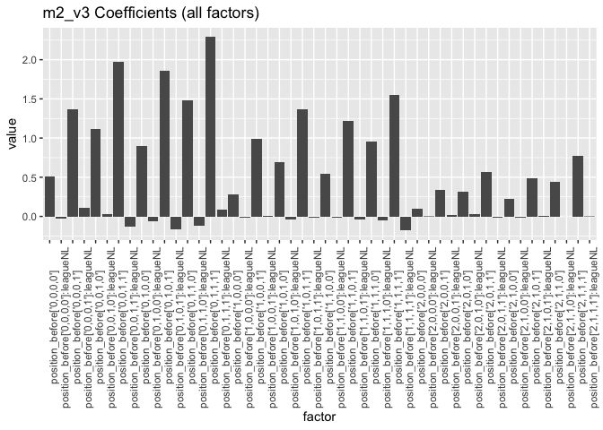

``` r
# Graph only position_before values
m2_v3_vt[1:24, ] %>%
  ggplot(aes(x = factor, y = value)) + geom_bar(stat = "identity") + 
  theme(axis.text.x = element_text(angle = 90)) +
  ggtitle("m2_v3 Coefficients (position_before only)")
```


``` r
# Graph interaction effect values
m2_v3_vt[25:48, ] %>%
  ggplot(aes(x = factor, y = value)) + geom_bar(stat = "identity") + 
  theme(axis.text.x = element_text(angle = 90)) +
  ggtitle("m2_v3 Coefficients (interaction only)")
```

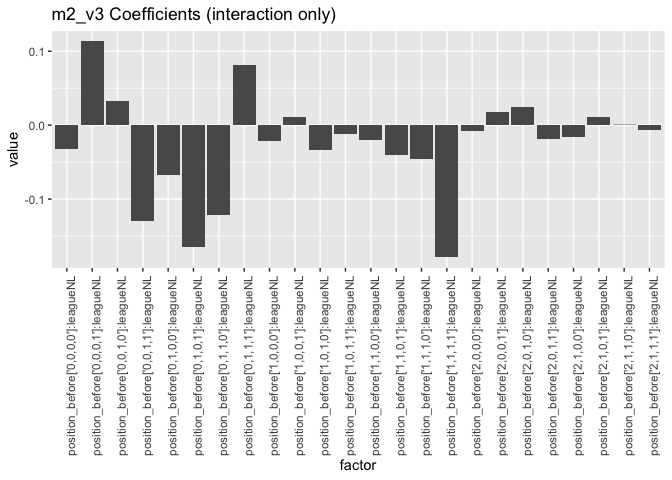

Model 3
=======

Model 3 Version 1: position\_before and park\_factor (no interaction)
---------------------------------------------------------------------

``` r
m3_v1 = lm(runs_scored_EOI ~ position_before + park_factor - 1, 
           dat = dt)
summary(m2_v1)
```

    ## 
    ## Call:
    ## lm(formula = runs_scored_EOI ~ position_before + league - 1, 
    ##     data = dt)
    ## 
    ## Residuals:
    ##     Min      1Q  Median      3Q     Max 
    ## -2.3397 -0.5016 -0.2566 -0.0877 10.4898 
    ## 
    ## Coefficients:
    ##                             Estimate Std. Error t value Pr(>|t|)    
    ## position_before['0,0,0,0']  0.510197   0.005070 100.633  < 2e-16 ***
    ## position_before['0,0,0,1']  1.436382   0.045266  31.732  < 2e-16 ***
    ## position_before['0,0,1,0']  1.140777   0.017483  65.252  < 2e-16 ***
    ## position_before['0,0,1,1']  1.925995   0.038563  49.944  < 2e-16 ***
    ## position_before['0,1,0,0']  0.880217   0.009998  88.042  < 2e-16 ***
    ## position_before['0,1,0,1']  1.794295   0.032848  54.624  < 2e-16 ***
    ## position_before['0,1,1,0']  1.427949   0.019460  73.380  < 2e-16 ***
    ## position_before['0,1,1,1']  2.339695   0.037602  62.222  < 2e-16 ***
    ## position_before['1,0,0,0']  0.280238   0.005765  48.614  < 2e-16 ***
    ## position_before['1,0,0,1']  1.011802   0.023206  43.601  < 2e-16 ***
    ## position_before['1,0,1,0']  0.690043   0.013955  49.448  < 2e-16 ***
    ## position_before['1,0,1,1']  1.369245   0.024604  55.652  < 2e-16 ***
    ## position_before['1,1,0,0']  0.543741   0.009091  59.811  < 2e-16 ***
    ## position_before['1,1,0,1']  1.212156   0.022197  54.608  < 2e-16 ***
    ## position_before['1,1,1,0']  0.943665   0.014771  63.887  < 2e-16 ***
    ## position_before['1,1,1,1']  1.469996   0.024064  61.086  < 2e-16 ***
    ## position_before['2,0,0,0']  0.111306   0.006368  17.480  < 2e-16 ***
    ## position_before['2,0,0,1']  0.353521   0.018913  18.692  < 2e-16 ***
    ## position_before['2,0,1,0']  0.336744   0.012056  27.932  < 2e-16 ***
    ## position_before['2,0,1,1']  0.572937   0.022686  25.255  < 2e-16 ***
    ## position_before['2,1,0,0']  0.226861   0.009074  25.002  < 2e-16 ***
    ## position_before['2,1,0,1']  0.501595   0.019757  25.389  < 2e-16 ***
    ## position_before['2,1,1,0']  0.455477   0.013336  34.153  < 2e-16 ***
    ## position_before['2,1,1,1']  0.777376   0.021262  36.562  < 2e-16 ***
    ## leagueNL                   -0.023604   0.004503  -5.242 1.59e-07 ***
    ## ---
    ## Signif. codes:  0 '***' 0.001 '**' 0.01 '*' 0.05 '.' 0.1 ' ' 1
    ## 
    ## Residual standard error: 0.9695 on 185476 degrees of freedom
    ## Multiple R-squared:  0.2737, Adjusted R-squared:  0.2736 
    ## F-statistic:  2795 on 25 and 185476 DF,  p-value: < 2.2e-16

``` r
m3_v1_vt = m3_v1$coefficients %>% data.table(factor = names(.), value = .)

# Graph all factor values
m3_v1_vt %>%
  ggplot(aes(x = factor, y = value)) + geom_bar(stat = "identity") + 
  theme(axis.text.x = element_text(angle = 90)) +
  ggtitle("m3_v1 Coefficients (all factors)")
```

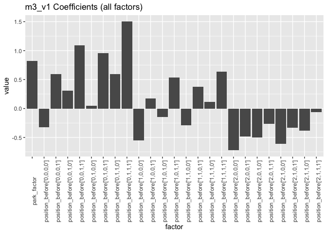

Model 3 Version 2: position\_before and park\_factor (include main park\_factor effect)
---------------------------------------------------------------------------------------

``` r
m3_v2 = lm(runs_scored_EOI ~ position_before * park_factor - 1, 
           dat = dt)
summary(m3_v2)
```

    ## 
    ## Call:
    ## lm(formula = runs_scored_EOI ~ position_before * park_factor - 
    ##     1, data = dt)
    ## 
    ## Residuals:
    ##     Min      1Q  Median      3Q     Max 
    ## -2.4802 -0.4958 -0.2620 -0.0912 10.4502 
    ## 
    ## Coefficients:
    ##                                        Estimate Std. Error t value
    ## position_before['0,0,0,0']             -0.53775    0.10636  -5.056
    ## position_before['0,0,0,1']              1.23408    0.92570   1.333
    ## position_before['0,0,1,0']              0.27452    0.39858   0.689
    ## position_before['0,0,1,1']             -1.56655    0.95353  -1.643
    ## position_before['0,1,0,0']             -0.66943    0.22747  -2.943
    ## position_before['0,1,0,1']             -1.48965    0.73795  -2.019
    ## position_before['0,1,1,0']              1.05167    0.47232   2.227
    ## position_before['0,1,1,1']              1.36564    0.93689   1.458
    ## position_before['1,0,0,0']             -0.38299    0.12435  -3.080
    ## position_before['1,0,0,1']              0.15497    0.51762   0.299
    ## position_before['1,0,1,0']             -0.89229    0.31389  -2.843
    ## position_before['1,0,1,1']             -0.02453    0.56382  -0.044
    ## position_before['1,1,0,0']             -0.35436    0.20464  -1.732
    ## position_before['1,1,0,1']              0.84989    0.49555   1.715
    ## position_before['1,1,1,0']             -0.68090    0.34522  -1.972
    ## position_before['1,1,1,1']             -0.52656    0.57796  -0.911
    ## position_before['2,0,0,0']             -0.10987    0.14017  -0.784
    ## position_before['2,0,0,1']             -0.30280    0.41295  -0.733
    ## position_before['2,0,1,0']             -0.40854    0.26753  -1.527
    ## position_before['2,0,1,1']             -0.22450    0.52197  -0.430
    ## position_before['2,1,0,0']             -0.18311    0.21009  -0.872
    ## position_before['2,1,0,1']             -0.62206    0.44962  -1.384
    ## position_before['2,1,1,0']             -0.18733    0.30221  -0.620
    ## position_before['2,1,1,1']              0.52102    0.51259   1.016
    ## park_factor                             1.03580    0.10623   9.750
    ## position_before['0,0,0,1']:park_factor -0.84721    0.92468  -0.916
    ## position_before['0,0,1,0']:park_factor -0.18327    0.41089  -0.446
    ## position_before['0,0,1,1']:park_factor  2.44146    0.95754   2.550
    ## position_before['0,1,0,0']:park_factor  0.49988    0.25061   1.995
    ## position_before['0,1,0,1']:park_factor  2.22924    0.74317   3.000
    ## position_before['0,1,1,0']:park_factor -0.67168    0.48309  -1.390
    ## position_before['0,1,1,1']:park_factor -0.07493    0.94038  -0.080
    ## position_before['1,0,0,0']:park_factor -0.38428    0.16347  -2.351
    ## position_before['1,0,0,1']:park_factor -0.19473    0.52554  -0.371
    ## position_before['1,0,1,0']:park_factor  0.53121    0.33038   1.608
    ## position_before['1,0,1,1']:park_factor  0.34155    0.57121   0.598
    ## position_before['1,1,0,0']:park_factor -0.15026    0.23026  -0.653
    ## position_before['1,1,0,1']:park_factor -0.68636    0.50511  -1.359
    ## position_before['1,1,1,0']:park_factor  0.57619    0.36073   1.597
    ## position_before['1,1,1,1']:park_factor  0.94480    0.58614   1.612
    ## position_before['2,0,0,0']:park_factor -0.82636    0.17582  -4.700
    ## position_before['2,0,0,1']:park_factor -0.39378    0.42428  -0.928
    ## position_before['2,0,1,0']:park_factor -0.30430    0.28702  -1.060
    ## position_before['2,0,1,1']:park_factor -0.25293    0.53049  -0.477
    ## position_before['2,1,0,0']:park_factor -0.63754    0.23532  -2.709
    ## position_before['2,1,0,1']:park_factor  0.07257    0.46023   0.158
    ## position_before['2,1,1,0']:park_factor -0.40562    0.31986  -1.268
    ## position_before['2,1,1,1']:park_factor -0.79275    0.52197  -1.519
    ##                                        Pr(>|t|)    
    ## position_before['0,0,0,0']             4.29e-07 ***
    ## position_before['0,0,0,1']              0.18249    
    ## position_before['0,0,1,0']              0.49099    
    ## position_before['0,0,1,1']              0.10041    
    ## position_before['0,1,0,0']              0.00325 ** 
    ## position_before['0,1,0,1']              0.04353 *  
    ## position_before['0,1,1,0']              0.02598 *  
    ## position_before['0,1,1,1']              0.14494    
    ## position_before['1,0,0,0']              0.00207 ** 
    ## position_before['1,0,0,1']              0.76464    
    ## position_before['1,0,1,0']              0.00447 ** 
    ## position_before['1,0,1,1']              0.96530    
    ## position_before['1,1,0,0']              0.08333 .  
    ## position_before['1,1,0,1']              0.08634 .  
    ## position_before['1,1,1,0']              0.04857 *  
    ## position_before['1,1,1,1']              0.36226    
    ## position_before['2,0,0,0']              0.43316    
    ## position_before['2,0,0,1']              0.46340    
    ## position_before['2,0,1,0']              0.12674    
    ## position_before['2,0,1,1']              0.66712    
    ## position_before['2,1,0,0']              0.38345    
    ## position_before['2,1,0,1']              0.16651    
    ## position_before['2,1,1,0']              0.53534    
    ## position_before['2,1,1,1']              0.30942    
    ## park_factor                             < 2e-16 ***
    ## position_before['0,0,0,1']:park_factor  0.35955    
    ## position_before['0,0,1,0']:park_factor  0.65557    
    ## position_before['0,0,1,1']:park_factor  0.01078 *  
    ## position_before['0,1,0,0']:park_factor  0.04608 *  
    ## position_before['0,1,0,1']:park_factor  0.00270 ** 
    ## position_before['0,1,1,0']:park_factor  0.16442    
    ## position_before['0,1,1,1']:park_factor  0.93649    
    ## position_before['1,0,0,0']:park_factor  0.01874 *  
    ## position_before['1,0,0,1']:park_factor  0.71099    
    ## position_before['1,0,1,0']:park_factor  0.10787    
    ## position_before['1,0,1,1']:park_factor  0.54988    
    ## position_before['1,1,0,0']:park_factor  0.51403    
    ## position_before['1,1,0,1']:park_factor  0.17420    
    ## position_before['1,1,1,0']:park_factor  0.11020    
    ## position_before['1,1,1,1']:park_factor  0.10698    
    ## position_before['2,0,0,0']:park_factor 2.60e-06 ***
    ## position_before['2,0,0,1']:park_factor  0.35334    
    ## position_before['2,0,1,0']:park_factor  0.28906    
    ## position_before['2,0,1,1']:park_factor  0.63352    
    ## position_before['2,1,0,0']:park_factor  0.00674 ** 
    ## position_before['2,1,0,1']:park_factor  0.87471    
    ## position_before['2,1,1,0']:park_factor  0.20476    
    ## position_before['2,1,1,1']:park_factor  0.12882    
    ## ---
    ## Signif. codes:  0 '***' 0.001 '**' 0.01 '*' 0.05 '.' 0.1 ' ' 1
    ## 
    ## Residual standard error: 0.9688 on 185453 degrees of freedom
    ## Multiple R-squared:  0.2748, Adjusted R-squared:  0.2746 
    ## F-statistic:  1464 on 48 and 185453 DF,  p-value: < 2.2e-16

``` r
m3_v2_vt = m3_v2$coefficients %>% data.table(factor = names(.), value = .)

# Graph all factor values
m3_v2_vt %>%
  ggplot(aes(x = factor, y = value)) + geom_bar(stat = "identity") + 
  theme(axis.text.x = element_text(angle = 90)) +
  ggtitle("m3_v2 Coefficients (all factors)")
```

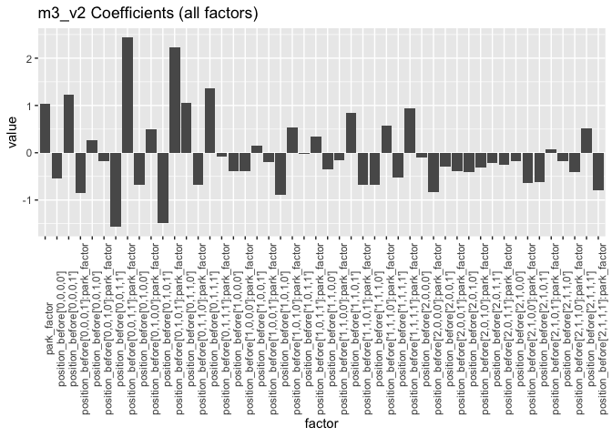

``` r
# Graph only position_before values
m3_v2_vt[1:24, ] %>%
  ggplot(aes(x = factor, y = value)) + geom_bar(stat = "identity") + 
  theme(axis.text.x = element_text(angle = 90)) +
  ggtitle("m3_v2 Coefficients (position_before only)")
```


``` r
# Graph interaction effect values
m3_v2_vt[25:48, ] %>%
  ggplot(aes(x = factor, y = value)) + geom_bar(stat = "identity") + 
  theme(axis.text.x = element_text(angle = 90)) +
  ggtitle("m3_v2 Coefficients (interaction only)")
```

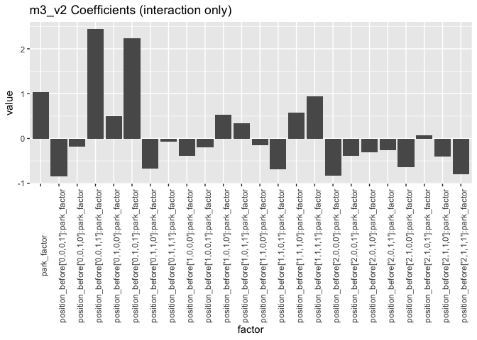

Model 3 Version 3: position\_before and park\_factor (without main park\_factor effect)
---------------------------------------------------------------------------------------

``` r
m3_v3 = lm(runs_scored_EOI ~ position_before + position_before:park_factor - 1, 
           dat = dt)
summary(m3_v3)
```

    ## 
    ## Call:
    ## lm(formula = runs_scored_EOI ~ position_before + position_before:park_factor - 
    ##     1, data = dt)
    ## 
    ## Residuals:
    ##     Min      1Q  Median      3Q     Max 
    ## -2.4802 -0.4958 -0.2620 -0.0912 10.4502 
    ## 
    ## Coefficients:
    ##                                        Estimate Std. Error t value
    ## position_before['0,0,0,0']             -0.53775    0.10636  -5.056
    ## position_before['0,0,0,1']              1.23408    0.92570   1.333
    ## position_before['0,0,1,0']              0.27452    0.39858   0.689
    ## position_before['0,0,1,1']             -1.56655    0.95353  -1.643
    ## position_before['0,1,0,0']             -0.66943    0.22747  -2.943
    ## position_before['0,1,0,1']             -1.48965    0.73795  -2.019
    ## position_before['0,1,1,0']              1.05167    0.47232   2.227
    ## position_before['0,1,1,1']              1.36564    0.93689   1.458
    ## position_before['1,0,0,0']             -0.38299    0.12435  -3.080
    ## position_before['1,0,0,1']              0.15497    0.51762   0.299
    ## position_before['1,0,1,0']             -0.89229    0.31389  -2.843
    ## position_before['1,0,1,1']             -0.02453    0.56382  -0.044
    ## position_before['1,1,0,0']             -0.35436    0.20464  -1.732
    ## position_before['1,1,0,1']              0.84989    0.49555   1.715
    ## position_before['1,1,1,0']             -0.68090    0.34522  -1.972
    ## position_before['1,1,1,1']             -0.52656    0.57796  -0.911
    ## position_before['2,0,0,0']             -0.10987    0.14017  -0.784
    ## position_before['2,0,0,1']             -0.30280    0.41295  -0.733
    ## position_before['2,0,1,0']             -0.40854    0.26753  -1.527
    ## position_before['2,0,1,1']             -0.22450    0.52197  -0.430
    ## position_before['2,1,0,0']             -0.18311    0.21009  -0.872
    ## position_before['2,1,0,1']             -0.62206    0.44962  -1.384
    ## position_before['2,1,1,0']             -0.18733    0.30221  -0.620
    ## position_before['2,1,1,1']              0.52102    0.51259   1.016
    ## position_before['0,0,0,0']:park_factor  1.03580    0.10623   9.750
    ## position_before['0,0,0,1']:park_factor  0.18859    0.91856   0.205
    ## position_before['0,0,1,0']:park_factor  0.85253    0.39692   2.148
    ## position_before['0,0,1,1']:park_factor  3.47726    0.95163   3.654
    ## position_before['0,1,0,0']:park_factor  1.53568    0.22698   6.766
    ## position_before['0,1,0,1']:park_factor  3.26504    0.73554   4.439
    ## position_before['0,1,1,0']:park_factor  0.36412    0.47127   0.773
    ## position_before['0,1,1,1']:park_factor  0.96087    0.93436   1.028
    ## position_before['1,0,0,0']:park_factor  0.65152    0.12425   5.244
    ## position_before['1,0,0,1']:park_factor  0.84107    0.51469   1.634
    ## position_before['1,0,1,0']:park_factor  1.56701    0.31284   5.009
    ## position_before['1,0,1,1']:park_factor  1.37735    0.56125   2.454
    ## position_before['1,1,0,0']:park_factor  0.88554    0.20429   4.335
    ## position_before['1,1,0,1']:park_factor  0.34944    0.49381   0.708
    ## position_before['1,1,1,0']:park_factor  1.61200    0.34473   4.676
    ## position_before['1,1,1,1']:park_factor  1.98061    0.57643   3.436
    ## position_before['2,0,0,0']:park_factor  0.20944    0.14010   1.495
    ## position_before['2,0,0,1']:park_factor  0.64202    0.41076   1.563
    ## position_before['2,0,1,0']:park_factor  0.73150    0.26664   2.743
    ## position_before['2,0,1,1']:park_factor  0.78287    0.51975   1.506
    ## position_before['2,1,0,0']:park_factor  0.39826    0.20998   1.897
    ## position_before['2,1,0,1']:park_factor  1.10837    0.44781   2.475
    ## position_before['2,1,1,0']:park_factor  0.63018    0.30170   2.089
    ## position_before['2,1,1,1']:park_factor  0.24305    0.51105   0.476
    ##                                        Pr(>|t|)    
    ## position_before['0,0,0,0']             4.29e-07 ***
    ## position_before['0,0,0,1']             0.182486    
    ## position_before['0,0,1,0']             0.490987    
    ## position_before['0,0,1,1']             0.100406    
    ## position_before['0,1,0,0']             0.003252 ** 
    ## position_before['0,1,0,1']             0.043526 *  
    ## position_before['0,1,1,0']             0.025975 *  
    ## position_before['0,1,1,1']             0.144944    
    ## position_before['1,0,0,0']             0.002070 ** 
    ## position_before['1,0,0,1']             0.764637    
    ## position_before['1,0,1,0']             0.004474 ** 
    ## position_before['1,0,1,1']             0.965301    
    ## position_before['1,1,0,0']             0.083334 .  
    ## position_before['1,1,0,1']             0.086340 .  
    ## position_before['1,1,1,0']             0.048571 *  
    ## position_before['1,1,1,1']             0.362258    
    ## position_before['2,0,0,0']             0.433164    
    ## position_before['2,0,0,1']             0.463398    
    ## position_before['2,0,1,0']             0.126735    
    ## position_before['2,0,1,1']             0.667118    
    ## position_before['2,1,0,0']             0.383448    
    ## position_before['2,1,0,1']             0.166513    
    ## position_before['2,1,1,0']             0.535340    
    ## position_before['2,1,1,1']             0.309416    
    ## position_before['0,0,0,0']:park_factor  < 2e-16 ***
    ## position_before['0,0,0,1']:park_factor 0.837330    
    ## position_before['0,0,1,0']:park_factor 0.031726 *  
    ## position_before['0,0,1,1']:park_factor 0.000258 ***
    ## position_before['0,1,0,0']:park_factor 1.33e-11 ***
    ## position_before['0,1,0,1']:park_factor 9.04e-06 ***
    ## position_before['0,1,1,0']:park_factor 0.439736    
    ## position_before['0,1,1,1']:park_factor 0.303775    
    ## position_before['1,0,0,0']:park_factor 1.58e-07 ***
    ## position_before['1,0,0,1']:park_factor 0.102229    
    ## position_before['1,0,1,0']:park_factor 5.48e-07 ***
    ## position_before['1,0,1,1']:park_factor 0.014125 *  
    ## position_before['1,1,0,0']:park_factor 1.46e-05 ***
    ## position_before['1,1,0,1']:park_factor 0.479171    
    ## position_before['1,1,1,0']:park_factor 2.93e-06 ***
    ## position_before['1,1,1,1']:park_factor 0.000591 ***
    ## position_before['2,0,0,0']:park_factor 0.134946    
    ## position_before['2,0,0,1']:park_factor 0.118059    
    ## position_before['2,0,1,0']:park_factor 0.006080 ** 
    ## position_before['2,0,1,1']:park_factor 0.132006    
    ## position_before['2,1,0,0']:park_factor 0.057870 .  
    ## position_before['2,1,0,1']:park_factor 0.013320 *  
    ## position_before['2,1,1,0']:park_factor 0.036733 *  
    ## position_before['2,1,1,1']:park_factor 0.634368    
    ## ---
    ## Signif. codes:  0 '***' 0.001 '**' 0.01 '*' 0.05 '.' 0.1 ' ' 1
    ## 
    ## Residual standard error: 0.9688 on 185453 degrees of freedom
    ## Multiple R-squared:  0.2748, Adjusted R-squared:  0.2746 
    ## F-statistic:  1464 on 48 and 185453 DF,  p-value: < 2.2e-16

``` r
m3_v3_vt = m3_v3$coefficients %>% data.table(factor = names(.), value = .)

# Graph all factor values
m3_v3_vt %>%
  ggplot(aes(x = factor, y = value)) + geom_bar(stat = "identity") + 
  theme(axis.text.x = element_text(angle = 90)) +
  ggtitle("m3_v3 Coefficients (all factors)")
```

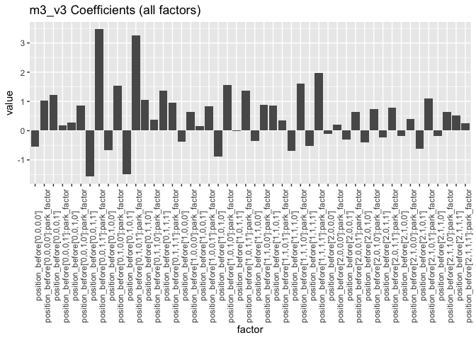

``` r
# Graph only position_before values
m3_v3_vt[1:24, ] %>%
  ggplot(aes(x = factor, y = value)) + geom_bar(stat = "identity") + 
  theme(axis.text.x = element_text(angle = 90)) +
  ggtitle("m3_v3 Coefficients (position_before only)")
```

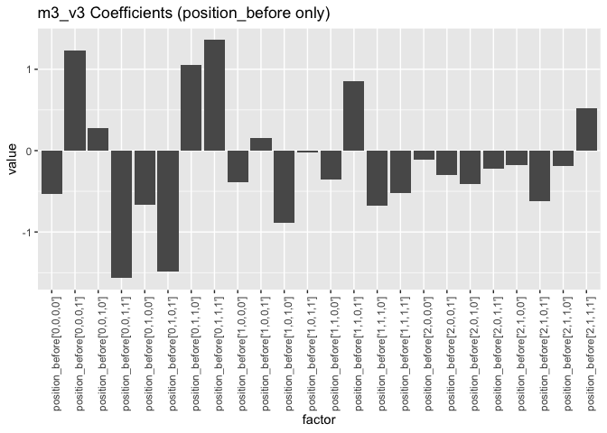

``` r
# Graph interaction effect values
m3_v3_vt[25:48, ] %>%
  ggplot(aes(x = factor, y = value)) + geom_bar(stat = "identity") + 
  theme(axis.text.x = element_text(angle = 90)) +
  ggtitle("m3_v3 Coefficients (interaction only)")
```

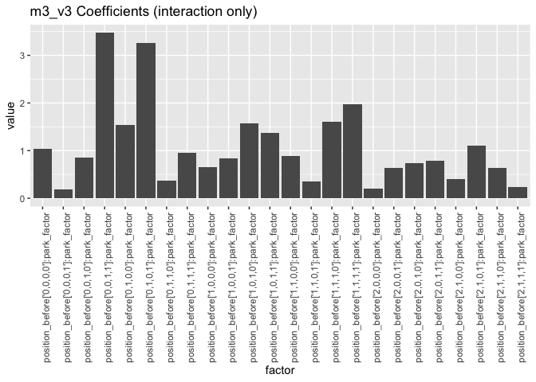

Model 4
=======

Model 4 Version 1: position\_before and FIP (no interaction)
------------------------------------------------------------

``` r
m4_v1 = lm(runs_scored_EOI ~ position_before + FIP - 1, 
           dat = dt)
summary(m4_v1)
```

    ## 
    ## Call:
    ## lm(formula = runs_scored_EOI ~ position_before + FIP - 1, data = dt)
    ## 
    ## Residuals:
    ##     Min      1Q  Median      3Q     Max 
    ## -3.2007 -0.4842 -0.2612 -0.0191 10.5318 
    ## 
    ## Coefficients:
    ##                             Estimate Std. Error t value Pr(>|t|)    
    ## position_before['0,0,0,0']  0.163521   0.008775  18.635  < 2e-16 ***
    ## position_before['0,0,0,1']  1.076655   0.045628  23.596  < 2e-16 ***
    ## position_before['0,0,1,0']  0.787936   0.018898  41.695  < 2e-16 ***
    ## position_before['0,0,1,1']  1.565246   0.039091  40.041  < 2e-16 ***
    ## position_before['0,1,0,0']  0.528744   0.012321  42.913  < 2e-16 ***
    ## position_before['0,1,0,1']  1.443848   0.033475  43.132  < 2e-16 ***
    ## position_before['0,1,1,0']  1.069202   0.020751  51.524  < 2e-16 ***
    ## position_before['0,1,1,1']  1.981381   0.038140  51.950  < 2e-16 ***
    ## position_before['1,0,0,0'] -0.064337   0.009160  -7.024 2.17e-12 ***
    ## position_before['1,0,0,1']  0.659701   0.024212  27.247  < 2e-16 ***
    ## position_before['1,0,1,0']  0.340494   0.015671  21.727  < 2e-16 ***
    ## position_before['1,0,1,1']  1.015391   0.025561  39.724  < 2e-16 ***
    ## position_before['1,1,0,0']  0.194067   0.011595  16.737  < 2e-16 ***
    ## position_before['1,1,0,1']  0.855059   0.023291  36.712  < 2e-16 ***
    ## position_before['1,1,1,0']  0.589383   0.016440  35.851  < 2e-16 ***
    ## position_before['1,1,1,1']  1.115189   0.025031  44.553  < 2e-16 ***
    ## position_before['2,0,0,0'] -0.231984   0.009523 -24.359  < 2e-16 ***
    ## position_before['2,0,0,1']  0.004412   0.020165   0.219    0.827    
    ## position_before['2,0,1,0'] -0.011053   0.013985  -0.790    0.429    
    ## position_before['2,0,1,1']  0.221759   0.023709   9.353  < 2e-16 ***
    ## position_before['2,1,0,0'] -0.120437   0.011548 -10.429  < 2e-16 ***
    ## position_before['2,1,0,1']  0.148712   0.020973   7.091 1.34e-12 ***
    ## position_before['2,1,1,0']  0.104715   0.015120   6.926 4.35e-12 ***
    ## position_before['2,1,1,1']  0.418317   0.022403  18.672  < 2e-16 ***
    ## FIP                         0.079979   0.001800  44.444  < 2e-16 ***
    ## ---
    ## Signif. codes:  0 '***' 0.001 '**' 0.01 '*' 0.05 '.' 0.1 ' ' 1
    ## 
    ## Residual standard error: 0.9642 on 185472 degrees of freedom
    ##   (4 observations deleted due to missingness)
    ## Multiple R-squared:  0.2813, Adjusted R-squared:  0.2812 
    ## F-statistic:  2903 on 25 and 185472 DF,  p-value: < 2.2e-16

``` r
m4_v1_vt = m4_v1$coefficients %>% data.table(factor = names(.), value = .)

# Graph all factor values
m4_v1_vt %>%
  ggplot(aes(x = factor, y = value)) + geom_bar(stat = "identity") + 
  theme(axis.text.x = element_text(angle = 90)) +
  ggtitle("m4_v1 Coefficients (all factors)")
```

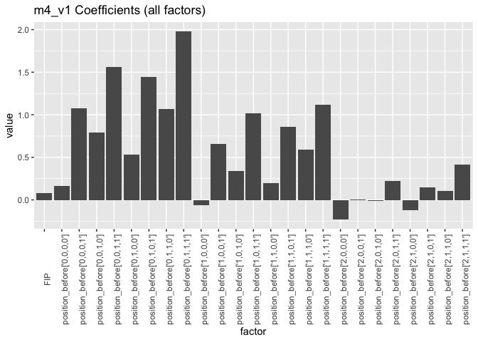

Model 4 Version 2: position\_before and FIP (include main FIP factor)
---------------------------------------------------------------------

``` r
m4_v2 = lm(runs_scored_EOI ~ position_before * FIP - 1, 
           dat = dt)
summary(m4_v2)
```

    ## 
    ## Call:
    ## lm(formula = runs_scored_EOI ~ position_before * FIP - 1, data = dt)
    ## 
    ## Residuals:
    ##     Min      1Q  Median      3Q     Max 
    ## -3.5603 -0.4783 -0.2595 -0.0684 10.5423 
    ## 
    ## Coefficients:
    ##                                 Estimate Std. Error t value Pr(>|t|)    
    ## position_before['0,0,0,0']      0.045094   0.016492   2.734 0.006251 ** 
    ## position_before['0,0,0,1']      1.205256   0.111461  10.813  < 2e-16 ***
    ## position_before['0,0,1,0']      0.601740   0.060323   9.975  < 2e-16 ***
    ## position_before['0,0,1,1']      1.510470   0.121267  12.456  < 2e-16 ***
    ## position_before['0,1,0,0']      0.360043   0.034448  10.452  < 2e-16 ***
    ## position_before['0,1,0,1']      1.247935   0.103847  12.017  < 2e-16 ***
    ## position_before['0,1,1,0']      1.010380   0.066300  15.239  < 2e-16 ***
    ## position_before['0,1,1,1']      2.110922   0.126684  16.663  < 2e-16 ***
    ## position_before['1,0,0,0']     -0.019157   0.019166  -1.000 0.317533    
    ## position_before['1,0,0,1']      0.664921   0.073596   9.035  < 2e-16 ***
    ## position_before['1,0,1,0']      0.250233   0.047291   5.291 1.22e-07 ***
    ## position_before['1,0,1,1']      0.737546   0.085779   8.598  < 2e-16 ***
    ## position_before['1,1,0,0']      0.168591   0.028723   5.869 4.38e-09 ***
    ## position_before['1,1,0,1']      0.690816   0.062326  11.084  < 2e-16 ***
    ## position_before['1,1,1,0']      0.546029   0.040657  13.430  < 2e-16 ***
    ## position_before['1,1,1,1']      1.029158   0.078915  13.041  < 2e-16 ***
    ## position_before['2,0,0,0']     -0.017135   0.022749  -0.753 0.451330    
    ## position_before['2,0,0,1']      0.134450   0.064258   2.092 0.036410 *  
    ## position_before['2,0,1,0']      0.144843   0.043362   3.340 0.000837 ***
    ## position_before['2,0,1,1']      0.078322   0.077304   1.013 0.310981    
    ## position_before['2,1,0,0']     -0.008303   0.031549  -0.263 0.792411    
    ## position_before['2,1,0,1']      0.331253   0.059736   5.545 2.94e-08 ***
    ## position_before['2,1,1,0']      0.197217   0.045004   4.382 1.18e-05 ***
    ## position_before['2,1,1,1']      0.456308   0.055301   8.251  < 2e-16 ***
    ## FIP                             0.108297   0.003793  28.550  < 2e-16 ***
    ## position_before['0,0,0,1']:FIP -0.057938   0.023798  -2.435 0.014910 *  
    ## position_before['0,0,1,0']:FIP  0.015241   0.014045   1.085 0.277861    
    ## position_before['0,0,1,1']:FIP -0.015787   0.026598  -0.594 0.552824    
    ## position_before['0,1,0,0']:FIP  0.011481   0.008674   1.324 0.185610    
    ## position_before['0,1,0,1']:FIP  0.017901   0.023570   0.759 0.447580    
    ## position_before['0,1,1,0']:FIP -0.014765   0.015105  -0.977 0.328334    
    ## position_before['0,1,1,1']:FIP -0.058180   0.028164  -2.066 0.038855 *  
    ## position_before['1,0,0,0']:FIP -0.039178   0.005831  -6.719 1.84e-11 ***
    ## position_before['1,0,0,1']:FIP -0.029546   0.016866  -1.752 0.079813 .  
    ## position_before['1,0,1,0']:FIP -0.006958   0.011364  -0.612 0.540330    
    ## position_before['1,0,1,1']:FIP  0.036574   0.019581   1.868 0.061784 .  
    ## position_before['1,1,0,0']:FIP -0.022287   0.007506  -2.969 0.002986 ** 
    ## position_before['1,1,0,1']:FIP  0.009740   0.014040   0.694 0.487846    
    ## position_before['1,1,1,0']:FIP -0.018197   0.009644  -1.887 0.059175 .  
    ## position_before['1,1,1,1']:FIP -0.008224   0.017979  -0.457 0.647375    
    ## position_before['2,0,0,0']:FIP -0.080158   0.006518 -12.299  < 2e-16 ***
    ## position_before['2,0,0,1']:FIP -0.059129   0.015054  -3.928 8.58e-05 ***
    ## position_before['2,0,1,0']:FIP -0.065455   0.010641  -6.151 7.71e-10 ***
    ## position_before['2,0,1,1']:FIP  0.005500   0.017850   0.308 0.757988    
    ## position_before['2,1,0,0']:FIP -0.055053   0.008163  -6.744 1.54e-11 ***
    ## position_before['2,1,0,1']:FIP -0.071127   0.013774  -5.164 2.42e-07 ***
    ## position_before['2,1,1,0']:FIP -0.050169   0.010858  -4.621 3.83e-06 ***
    ## position_before['2,1,1,1']:FIP -0.037094   0.012411  -2.989 0.002801 ** 
    ## ---
    ## Signif. codes:  0 '***' 0.001 '**' 0.01 '*' 0.05 '.' 0.1 ' ' 1
    ## 
    ## Residual standard error: 0.9635 on 185449 degrees of freedom
    ##   (4 observations deleted due to missingness)
    ## Multiple R-squared:  0.2824, Adjusted R-squared:  0.2822 
    ## F-statistic:  1520 on 48 and 185449 DF,  p-value: < 2.2e-16

``` r
m4_v2_vt = m4_v2$coefficients %>% data.table(factor = names(.), value = .)

# Graph all factor values
m4_v2_vt %>%
  ggplot(aes(x = factor, y = value)) + geom_bar(stat = "identity") + 
  theme(axis.text.x = element_text(angle = 90)) +
  ggtitle("m4_v2 Coefficients (all factors)")
```

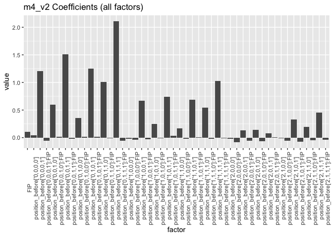

``` r
# Graph only position_before values
m4_v2_vt[1:24, ] %>%
  ggplot(aes(x = factor, y = value)) + geom_bar(stat = "identity") + 
  theme(axis.text.x = element_text(angle = 90)) +
  ggtitle("m4_v2 Coefficients (position_before only)")
```

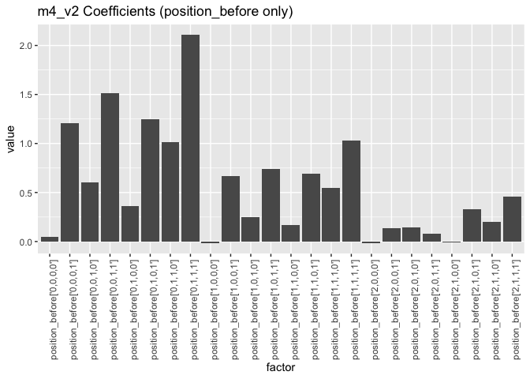

``` r
# Graph interaction effect values
m4_v2_vt[25:48, ] %>%
  ggplot(aes(x = factor, y = value)) + geom_bar(stat = "identity") + 
  theme(axis.text.x = element_text(angle = 90)) +
  ggtitle("m4_v2 Coefficients (interaction only)")
```


Model 4 Version 3: position\_before and FIP (without main FIP factor)
---------------------------------------------------------------------

``` r
m4_v3 = lm(runs_scored_EOI ~ position_before + position_before:FIP - 1, 
           dat = dt)
summary(m4_v3)
```

    ## 
    ## Call:
    ## lm(formula = runs_scored_EOI ~ position_before + position_before:FIP - 
    ##     1, data = dt)
    ## 
    ## Residuals:
    ##     Min      1Q  Median      3Q     Max 
    ## -3.5603 -0.4783 -0.2595 -0.0684 10.5423 
    ## 
    ## Coefficients:
    ##                                 Estimate Std. Error t value Pr(>|t|)    
    ## position_before['0,0,0,0']      0.045094   0.016492   2.734 0.006251 ** 
    ## position_before['0,0,0,1']      1.205256   0.111461  10.813  < 2e-16 ***
    ## position_before['0,0,1,0']      0.601740   0.060323   9.975  < 2e-16 ***
    ## position_before['0,0,1,1']      1.510470   0.121267  12.456  < 2e-16 ***
    ## position_before['0,1,0,0']      0.360043   0.034448  10.452  < 2e-16 ***
    ## position_before['0,1,0,1']      1.247935   0.103847  12.017  < 2e-16 ***
    ## position_before['0,1,1,0']      1.010380   0.066300  15.239  < 2e-16 ***
    ## position_before['0,1,1,1']      2.110922   0.126684  16.663  < 2e-16 ***
    ## position_before['1,0,0,0']     -0.019157   0.019166  -1.000 0.317533    
    ## position_before['1,0,0,1']      0.664921   0.073596   9.035  < 2e-16 ***
    ## position_before['1,0,1,0']      0.250233   0.047291   5.291 1.22e-07 ***
    ## position_before['1,0,1,1']      0.737546   0.085779   8.598  < 2e-16 ***
    ## position_before['1,1,0,0']      0.168591   0.028723   5.869 4.38e-09 ***
    ## position_before['1,1,0,1']      0.690816   0.062326  11.084  < 2e-16 ***
    ## position_before['1,1,1,0']      0.546029   0.040657  13.430  < 2e-16 ***
    ## position_before['1,1,1,1']      1.029158   0.078915  13.041  < 2e-16 ***
    ## position_before['2,0,0,0']     -0.017135   0.022749  -0.753 0.451330    
    ## position_before['2,0,0,1']      0.134450   0.064258   2.092 0.036410 *  
    ## position_before['2,0,1,0']      0.144843   0.043362   3.340 0.000837 ***
    ## position_before['2,0,1,1']      0.078322   0.077304   1.013 0.310981    
    ## position_before['2,1,0,0']     -0.008303   0.031549  -0.263 0.792411    
    ## position_before['2,1,0,1']      0.331253   0.059736   5.545 2.94e-08 ***
    ## position_before['2,1,1,0']      0.197217   0.045004   4.382 1.18e-05 ***
    ## position_before['2,1,1,1']      0.456308   0.055301   8.251  < 2e-16 ***
    ## position_before['0,0,0,0']:FIP  0.108297   0.003793  28.550  < 2e-16 ***
    ## position_before['0,0,0,1']:FIP  0.050360   0.023494   2.144 0.032070 *  
    ## position_before['0,0,1,0']:FIP  0.123538   0.013523   9.135  < 2e-16 ***
    ## position_before['0,0,1,1']:FIP  0.092510   0.026327   3.514 0.000442 ***
    ## position_before['0,1,0,0']:FIP  0.119779   0.007800  15.355  < 2e-16 ***
    ## position_before['0,1,0,1']:FIP  0.126198   0.023263   5.425 5.81e-08 ***
    ## position_before['0,1,1,0']:FIP  0.093532   0.014621   6.397 1.59e-10 ***
    ## position_before['0,1,1,1']:FIP  0.050117   0.027908   1.796 0.072524 .  
    ## position_before['1,0,0,0']:FIP  0.069120   0.004429  15.608  < 2e-16 ***
    ## position_before['1,0,0,1']:FIP  0.078752   0.016434   4.792 1.65e-06 ***
    ## position_before['1,0,1,0']:FIP  0.101339   0.010712   9.460  < 2e-16 ***
    ## position_before['1,0,1,1']:FIP  0.144871   0.019210   7.542 4.67e-14 ***
    ## position_before['1,1,0,0']:FIP  0.086010   0.006477  13.279  < 2e-16 ***
    ## position_before['1,1,0,1']:FIP  0.118037   0.013518   8.732  < 2e-16 ***
    ## position_before['1,1,1,0']:FIP  0.090100   0.008867  10.162  < 2e-16 ***
    ## position_before['1,1,1,1']:FIP  0.100073   0.017575   5.694 1.24e-08 ***
    ## position_before['2,0,0,0']:FIP  0.028139   0.005300   5.309 1.10e-07 ***
    ## position_before['2,0,0,1']:FIP  0.049168   0.014568   3.375 0.000738 ***
    ## position_before['2,0,1,0']:FIP  0.042842   0.009942   4.309 1.64e-05 ***
    ## position_before['2,0,1,1']:FIP  0.113797   0.017442   6.524 6.85e-11 ***
    ## position_before['2,1,0,0']:FIP  0.053244   0.007228   7.367 1.76e-13 ***
    ## position_before['2,1,0,1']:FIP  0.037170   0.013241   2.807 0.004998 ** 
    ## position_before['2,1,1,0']:FIP  0.058128   0.010174   5.714 1.11e-08 ***
    ## position_before['2,1,1,1']:FIP  0.071204   0.011817   6.026 1.69e-09 ***
    ## ---
    ## Signif. codes:  0 '***' 0.001 '**' 0.01 '*' 0.05 '.' 0.1 ' ' 1
    ## 
    ## Residual standard error: 0.9635 on 185449 degrees of freedom
    ##   (4 observations deleted due to missingness)
    ## Multiple R-squared:  0.2824, Adjusted R-squared:  0.2822 
    ## F-statistic:  1520 on 48 and 185449 DF,  p-value: < 2.2e-16

``` r
m4_v3_vt = m4_v3$coefficients %>% data.table(factor = names(.), value = .)

# Graph all factor values
m4_v3_vt %>%
  ggplot(aes(x = factor, y = value)) + geom_bar(stat = "identity") + 
  theme(axis.text.x = element_text(angle = 90)) +
  ggtitle("m4_v3 Coefficients (all factors)")
```

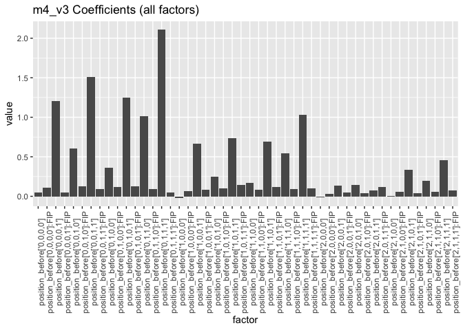

``` r
# Graph only position_before values
m4_v3_vt[1:24, ] %>%
  ggplot(aes(x = factor, y = value)) + geom_bar(stat = "identity") + 
  theme(axis.text.x = element_text(angle = 90)) +
  ggtitle("m4_v3 Coefficients (position_before only)")
```


``` r
# Graph interaction effect values
m4_v3_vt[25:48, ] %>%
  ggplot(aes(x = factor, y = value)) + geom_bar(stat = "identity") + 
  theme(axis.text.x = element_text(angle = 90)) +
  ggtitle("m4_v3 Coefficients (interaction only)")
```

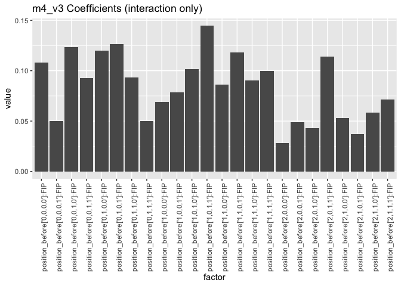
